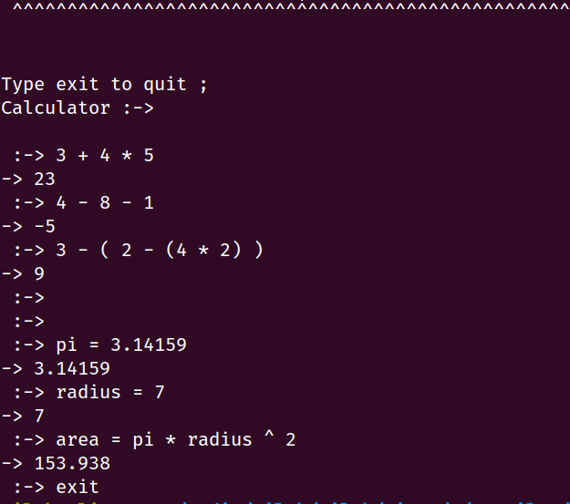

# Calculator
This isn't even a full calculator. It evaluates simple expression and supports following operator with given precedence : <br><br>
<pre>
parenthesis     -> ( ) <br>
unaray operator -> + - <br>
exponentiation  -> ^   <br>
mul / div       -> / * <br>
binary add/sub  -> + - <br>
assignment      -> =   <br>
</pre>
<br>
All operators are left assosciative except exponentiation ('^') operator.
<br>
<br>
There's no support for comparison or any bitwise operator.
<br>
<p align="left">
	
</p>

<br>
Simple error messages are displayed. So, don't make hard errors.
<br>
<p align="left">
	
</p>
<br>
<br>
<br> Note : No color support for windows (>.<)
<br>
# Build 
<br> 
For windows : <br>
``` bash 
Run `build.bat` 
```
<br>
It will generate bin/ folder if it doesn't exist and put executable inside bin.
<br>
Run `"bin\calculator.exe"` or 
`cd bin` <br>
`calculator.exe` 

<br>
<br>
For linux : 
<br> run `chmod u+x build.sh` to make it executable 
<br> run `./bin/calculator`
<br>


