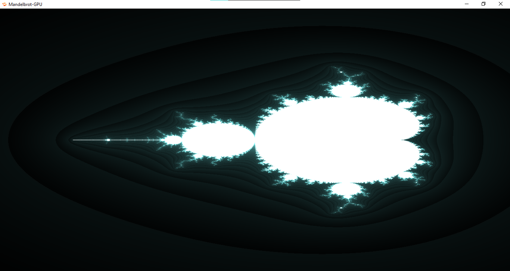

# [Mandelbrot Set](https://en.wikipedia.org/wiki/Mandelbrot_set)

## Usage
* Build by running the `build.bat` in Windows and `build.sh` in Linux
* The executables are generated in `bin/<compiler>` directory
* In the same directroy as the executables there exits `mandelbrot.frag` file
* You can edit and save the `mandelbrot.frag` file and it will automatically be reloaded by the program
* You can use the mouse wheel to zoom in and out

## Variables
*Note: The following variables are present in mandelbrot.frag file*
- `Radius` : Change the value and observe the result
- `ColorWeight` : Using this variable, control the output color of the Mandelbrot
- `MAX_ITERATIONS` : Change the number of iterations made in the calculation and observe the result

## Screeenshot

