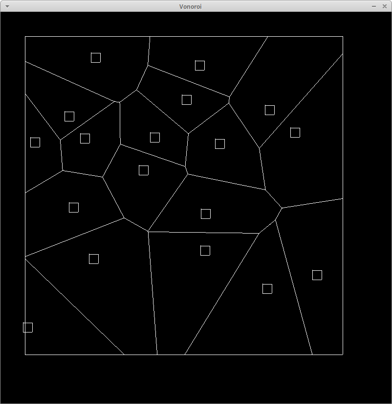

# Building
In `build.sh`, change the `INCLUDE` variable to the directory where your SDL header files are
and then run `build.sh`.

# Usage

Run `main`. 
You can change various parameters like the size of the bounding box and the inital
point directly from the first few lines of `main.c` (re-building is necessary).
Left click inside to insert a voronoi site in the diagram.

# TODO
* Add colored regions
* Maybe deletion of regions(?)

# Limitations
This implementation is not perfect and will surely have some bugs. Use with care!
